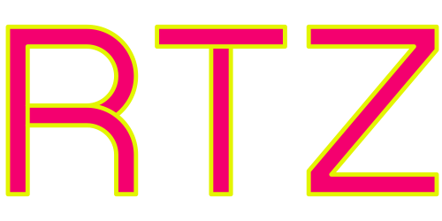

  

    <h4>A physical music marketplace for today.<h4>
     
     
    <a href="https://github.com/billycwong19/rtz-app"><strong>Explore the docs »</strong></a>
     
     
    <a href="https://super-froyo-3a16f8.netlify.app/">View Site</a>
    ·
    <a href="https://github.com/billycwong19/rtz-app/issues">Report Bug</a>
    ·
    <a href="https://github.com/billycwong19/rtz-app/issues">Request Feature</a>
  

  
Table of Contents

  <ol>
    <li>
      <a href="#about-the-project">About RTZ</a>
    </li>
      <ul>
        <li><a href="#license">License</a></li>
        <li><a href="#contact">Contact</a></li>
      </ul>
    </li>
  </ol>

## About The Project

    

RTZ is a new kind of marketplace to help connect collectors, buyers, and artists. At it's most refined stated, it's an app where you can sell parts of your library or even trade parts of your library to other enthusiasts who wish to continue the physical music medium. This current release is in its 'learning-to-crawl' state, and has plenty of room for improvement, so stay tuned!<a href="https://super-froyo-3a16f8.netlify.app/"> View Site Here</a>.

(<a href="#top">back to top</a>)

### License

Distributed under the MIT License. See `LICENSE.txt` for more information.

(<a href="#top">back to top</a>)

## Contact

Website coded by William Wong
 
Email: billycwong19@gmail.com

Portfolio: [https://williamwongjr.com](https://williamwongjr.com)

(<a href="#top">back to top</a>)

